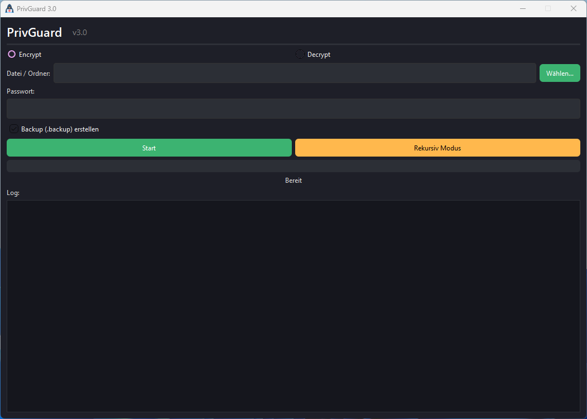

# 🔐 PrivGuard  


<p align="center">
  
  
  
  
  
  
</p>

---  
<p align="center">
  
</p>

<p align="center">
  <b>🔒 Moderne Dateiverschlüsselung mit Recovery-System, Dark Mode & Installer</b>
</p>

---

## 🚀 Features
- 🔑 AES-Verschlüsselung mit **Salt-Datei**  
- 🌙 Dunkles UI + **Log Panel**  
- 💻 Einfache Bedienung, moderne GUI (PyQt)  
- 🛠️ Installer via **Inno Setup**  
- 📦 Portable Version optional  
- 🌍 Multi-Language (Deutsch, Englisch, Französisch, bald mehr)  

---

## 📥 Installation

### 🪟 Windows (Empfohlen)
1. Lade den 👉 [PrivGuard Installer v3.0](https://github.com/Jaedini/PrivGuard/releases) herunter  
2. Führe den Installer aus  
3. Starte PrivGuard über Startmenü oder Desktop-Icon  

---

## 📸 Screenshots
<p align="center">  </p>

---

## 📦 Build
**Mit PyInstaller**
```bash
pyinstaller --noconsole --onefile --name PrivGuard src/main.py

## Installer erstellen (Inno Setup)
1. Lade [Inno Setup](https://jrsoftware.org/isinfo.php) herunter
2. Öffne setup/privguard.iss
3. Klicke auf **Build Installer**

---

## 📢 Release Notes
🚀 v3.0.0

- ✅ Neues Recovery-System mit Salt-Datei

- ✅ Überarbeitete GUI (Dark Mode + Log Panel)

- ✅ Installer über Inno Setup

- ✅ Neue Projektstruktur (src/, tests/, docs/)

---

## ❓ FAQ

**❓ Kann ich verschlüsselte Dateien wiederherstellen, wenn ich mein Passwort verliere?**  
➡️ Nur wenn du die Salt-Datei gesichert hast. Ohne Passwort + Salt-Datei ist eine Wiederherstellung unmöglich.  

**❓ Ist PrivGuard Open Source?**  
➡️ Ja, lizenziert unter MIT.  

**❓ Wo finde ich die Logs?**  
➡️ `%APPDATA%/PrivGuard/privguard.log`  

---

## 🔒 Security Policy

Melde Sicherheitsprobleme **nicht** öffentlich im Issue Tracker.  
Sende eine E-Mail an:  
📧 [privguardsupport@protonmail.com](mailto:privguardsupport@protonmail.com)  

---

## 👨‍💻 Maintainer
**Jaeden Hommel** – [GitHub](https://github.com/Jaedini)  

---

## 📬 Kontakt
📧 [privguardsupport@protonmail.com](mailto:privguardsupport@protonmail.com)  

---

## 🐙 GitHub
- 👉 [GitHub Issues](https://github.com/Jaedini/PrivGuard/issues)  
- 👉 [Releases](https://github.com/Jaedini/PrivGuard/releases)  
- 👉 [Pull Requests](https://github.com/Jaedini/PrivGuard/pulls)  

---

## 📜 Lizenz
Dieses Projekt ist unter der **MIT Lizenz** veröffentlicht.  
Siehe [LICENSE.md](LICENSE.md) für weitere Informationen.


## 🔧 Entwickler-Setup

```bash
git clone https://github.com/Jaedini/PrivGuard.git
cd PrivGuard
pip install -r requirements.txt
python main.py


